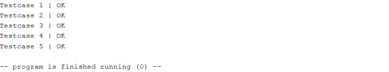
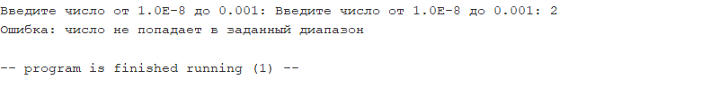
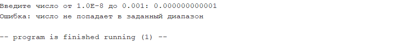
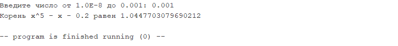
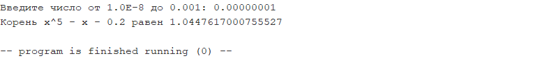
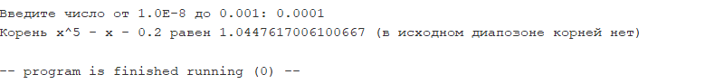

# ИДЗ №2

**Выполнил:** Тимергалин Тимур Маратович, группа БПИ227

## Запуск

Компиляция проводилась с флагами "Initialize program counter to global 'main' if defined" и "assemble all files currently open" (и никакими другими).

Чтобы запустить **основную программу**, открыть:

- idz2.asm
- io.asm
- math.asm

Чтобы запустить **тестовую программу**, открыть:

- idz2_test.asm
- io.asm
- math.asm

## Условие

**Вариант 37:** Разработать программу, определяющую корень уравнения x5 −x−0.2 = 0 методом хорд с точностью от 0,001 до 0,00000001 в диапазоне [1;1.1]. Если диапазон некорректен, то подобрать корректный диапазон.

## Решение

### Содержание

**Внимание:** эмулятор *RARS* работает с файлами кодировки *cp1251*, которая некорректно отображается в браузере. Скриптом  *convert_encoding.py* файлы были перекодированы в *utf-8*, результат лежит в папке *utf8*.

Решение состоит из следующих файлов:

- **convenience.inc** - макрос-библиотека с "quality-of-life" макросами;
- **idz2.asm** - исполняемый файл основной программы;
- **idz2_test.asm** - исполняемый файл тестовой программы;
- **io.asm** - библиотека подпрограмм для ввода-вывода данных, необходимых для этой задачи;
- **io.inc** - "интерфейс" **io.asm** - макрос-библиотека с макросами для удобного вызова подпрограмм из **io.asm**;
- **math.asm** - библиотека подпрограмм для математических вычислений, необходимых для этой задачи;
- **math.inc** - "интерфейс" **math.asm** - макрос-библиотека с макросами для удобного вызова подпрограмм из **math.asm**;
- **mfunc.inc** - макрос-библиотека для удобной работы с подпрограммами;
- **test.py** - аналогичный код на *Python*, вычисляющий всё до машинного 0 (для тестов).

### Соответствие решения требованиям

Представленное решение подразумевает оценку в 10 баллов.

#### Критерии на 10 баллов

- Программа разбита на несколько единиц компиляции;
- Ввод-вывод представлен единым модулем (**io.asm**);
- Макросы выделены в отдельную библиотеку (и даже не одну!);

#### Критерии на 9 баллов

- В программу добавлены макросы ввода-вывода данных;
- Тела подпрограмм обёрнуты в макросы;

#### Критерии на 8 баллов

- Разработанные подпрограммы поддерживают многократное использование с различными наборами исходных данных;
- Реализовано автоматизированное тестирование программы (**idz2_test.asm**);
- Осуществлены тестовые прогоны на языке высокого уровня (*Python*, **test.py**);

#### Критерии на 6-7 баллов

- В программе используются подпрограммы с передачей аргументов;
- Внутри подпрограмм используются локальные переменные, сохраняемые на стек (копия s-регистров);
- В местах вызова функций (где это было найдено уместным) присутствуют комментарии, описывающие соответствие между формальными и фактическими аргументами функций. Описание формальных параметров и возвращаемых значений описаны при определении функций.

#### Критерии на 4-5 баллов

- Приведено решение на языке assembler;
- Ввод данных осуществляется с клавиатуры;
- Вывод данных осуществляется в консоль;
- В программе присутствуют комментарии;
- Были проведены тестовые запуски программы (см. Результаты запуска и тестирования)

## Результаты запуска и тестирования

###  idz2_test.asm

 

### idz2.asm

 

 

 

 

### idz2.asm (с некорректным диапазоном)

 